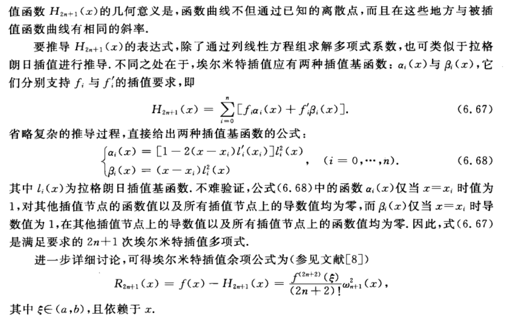

# 前言
采用了numpy，matplotlib库进行函数图像的展示。  
相关API这里不再介绍。  
关于插值，python的scipy库的interploate模块集成了多种插值，可以调用来验证自己实现的插值函数精确度。
# Problem1
## 1.Lagrange插值和Hermite插值
### Lagrange插值
可使用待定系数法，基函数法，牛顿法。由于其基函数的形式十分简单，故采用基函数的方法求解。对一组给定的插值点和需要代入计算的x，计算出每个基函数取x的值，乘以x点的函数值，再相加即可。用两层循环很容易实现。  
### Hermite插值
Hermite插值较为麻烦，因为其不仅要求在每个插值点函数值相等，还要求导数值相等。求解也有三种方法，待定系数法，基函数法，牛顿法。其基函数形式随着点的增多而变得复杂，公式如下：

  
比较复杂的是计算li(x)的导数，好在有规律可寻，可以用程序实现。
## 2.切比雪夫多项式零点的Lagrange插值
利用等距节点进行插值，往往会出现龙格现象，但利用切比雪夫零点进行插值，利用其余项的形式，以及切比雪夫多项式的性质（一个n次的首项系数是n的切比雪夫多项式，其是区间上所有次数小于等于n的首项系数为1的最大值最小的多项式），可知用切比雪夫的零点进行插值可使误差限最小。而且会一致收敛。  
切比雪夫多项式：Tn(x) = cos(n*arccos(x))，-1 <= x <= 1  
易知零点为：x = cos((2k + 1)/(2n) * π) , k = 0,1,2...,n-1  
一般区间可以经变换到[-1, 1]区间来求零点。
## 3.分段线性插值和分段三次Hermite插值
### 分段线性插值
对每个输入的x，判断其所在区间，然后在该区间用两点的拉格朗日插值很容易写出算式并计算出x的插值函数值。  
### 分段三次Hermite插值
对每个输入的x，判断其所在区间，然后在该区间用两点三次的Hermite插值计算x的插值函数值。由于两点三次的Hermite插值的基函数形式的推导和形式也不复杂，故采用基函数很容易写出算式并计算出插值函数值。
## 4.三次样条插值
三次样条插值，要求满足插值点函数值相等，插值点函数连续，一阶导连续，二阶导连续。注意这时候导数不一定等于原函数的导数值。  
设插值函数为S(x)。  
可以用类似两点三次的埃尔米特插值方法来求三次样条插值。  
也可以先假设插值函数的二阶导数值的形式（用拉格朗日插值写出），这样便满足二阶导数连续。然后求两次积分，并利用插值条件消去S(xj)和S'(xj)，得到的表达式满足插值条件，函数值连续，二阶导连续。然后再利用一阶导数连续，加上边界条件，即可求解。  
一般，若附加条件是边界点的一阶导数值，则最后得到的线性方程组的系数矩阵是三对角形式，而且该三对角阵满足顺序主子式不等于0，对角线元素是该列最大的元素，因此可利用高斯消元法求解，无误差放大效应。  
求解公式如下：  

  
# Problem2
## 1.复合梯形公式
梯形公式和辛普森公式都是等距分布的插值型求积公式的特例。其中梯形公式为插值点是两个的情况，辛普森公式是插值点为三个的情况。等距分布的插值型求积公式，设共有$x_0,x_1...,x_n$共n+1个插值点，那么当n为奇数时，其有n阶代数精度，当n为偶数时，其有n+1阶代数精度。  
梯形公式：S = (b - a)/2 * (f(a) + f(b))，具有一阶代数精度。  
辛普森公式：S = (b - a)/6 * (f(a) + 4*f((a+b)/2) + f(b))具有三阶代数精度。  
然后对区间进行划分，每个小区间应用公式，再累加即可。
## 2.复合辛普森公式
见复合梯形公式。
## 3.复合两点高斯公式
对于一般的机械求积公式：   
$\int_a^bf(x)\rho(x)dx$ = $\sum_{k=0}^nA_kf(x_k)$  
其有2n+2个未知参数，因此我们希望如果可以恰当选择$x_k$，使该机械求积公式达到2n+1的代数精度。这些点称为高斯点。  
一般思路是，待定2n+2个未知参数，然后对$f(x)=1,f(x)=x,f(x)=x^2...f(x)=x^{2n+1}$的情况列出2n+2个方程求解。但是该方法求解起来很困难。  
有更简单的结论来求高斯点：  
在[a, b]上带权$\rho(x)$的n+1次正交多项式的零点就是求积公式$\int_a^bf(x)\rho(x)dx$的高斯点，有了高斯点，便可代入$\sum_{k=0}^nA_kf(x_k)$中，然后对$f(x)=1,f(x)=x,f(x)=x^2...f(x)=x^n$的情况列出n+1个方程求解$A_i,i=0,1,...n-1,n$即可。
## 4.复合三点高斯公式
参考3
## 5.复合五点高斯公式
参考5
## 6.复合梯形公式，复合辛普森公式，复合三点高斯公式的误差收敛阶估计
（定理）若求积公式$\int_a^bf(x)dx$ = $\sum_{k=0}^nA_kf(x_k)$的代数精度为m，则余项可以表示为：$R[f] = \int_a^bf(x)dx - \sum_{k=0}^nA_kf(x_k) = Kf^{m+1}(\eta),\eta\in(a,b)$，其中K为与x无关的常数。  
（证明）略  
（延伸）令$f(x) = x^{m+1}$，代入后可得$K = \frac{1}{(m+1)!}[\frac{1}{m+2}(b^{m+2} - a^{m+2}) - \sum_{k=0}^nA_kx_k^{m+1}]$  
则易得梯形公式的余项为$R[f] = -\frac{(b - a)^3}{12}f''(\eta)$，辛普森公式余项为$R[f] = -\frac{b-a}{180}(\frac{b-a}{2})^4f^{(4)}(\eta)$  
（复合情况）以梯形公式为例，其余情况可以类比得到。  
对于复合的形式，其误差是由每个子区间的误差累加而来的，故：  
$R_n(f) = \sum_{k=0}^{n-1}[-\frac{h^3}{12}f''(\eta_k)],\eta_k\in(x_k,x_{k+1})$  
由于$f(x)\in C^2[a,b]$，故$\exists\eta\in(a,b)$，使$f''(\eta) = \frac1n\sum_{k=0}^{n-1}f''(\eta_k)$  
因此余项变为$R_n(f) = -\frac{b-a}{12}h^2f''(\eta)$  

（定理）对于$x_0,x_1,...,x_n$共n+1个点。高斯求积公式$\int_a^bf(x)dx = \sum_{k=0}^nA_kf(x_k)$的余项可以表示为：  
$R[f] = \frac{f^{(2n+2)}(\eta)}{(2n+2)!}\int_a^bw_{n+1}^2(x)\rho(x)dx$  
（证明）利用$f(x)$在高斯点的埃尔米特插值$H_{2n+1}(x)$，于是$f(x) = H_{2n+1}(x) + \frac{f^{2n+2}(\xi)}{(2n+2)!}w_{n+1}^2(x)$。  
两边同乘以$\rho(x)$后，从a到b进行积分，于是$\int_a^bf(x)\rho(x)dx = \int_a^bH_{2n+1}\rho(x)dx + R_n[f]$，根据余项形式，该等式对2n+1次多项式都是精确成立的，也就是说$\int_a^bH_{2n+1}\rho(x)dx$便是高斯求积公式，$R_n[f]$便是其余项。  
所以$R_n[f] = \int_a^b\frac{f^{2n+2}(\xi)}{(2n+2)!}w_{n+1}^2(x)\rho(x)dx$，由于$w_{n+1}^2(x)\rho(x)\geq0$，故由积分中值定理可知$R[f] = \frac{f^{(2n+2)}(\eta)}{(2n+2)!}\int_a^bw_{n+1}^2(x)\rho(x)dx$  
（延伸）埃尔米特插值和高斯求积公式有一定的联系：对高斯点进行埃尔米特插值，得到的插值公式再进行积分后便是高斯求积公式。

